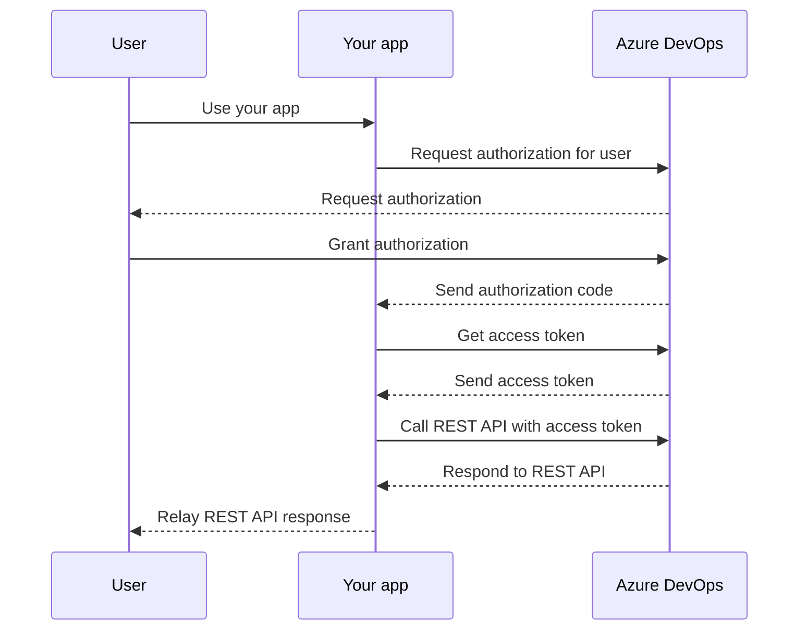

```mermaid
 sequenceDiagram
 participant U as User
 participant A as Your app
 participant D as Azure DevOps
 U->>A: Use your app
 A->>D: Request authorization for user
 D-->>U: Request authorization
 U->>D: Grant authorization
 D-->>A: Send authorization code
 A->>D: Get access token
 D-->>A: Send access token
 A->>D: Call REST API with access token
 D-->>A: Respond to REST API
 A-->>U: Relay REST API response
```
